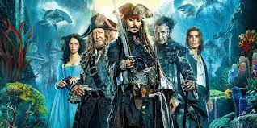

# Challenge Title

Here, you should write the title and description of the challenge. The description usually include humor or fantasy sentences and are not strict or scientific. Recall that we have tought about **Jack Sparrow** as the main character of the *UCTF* and thus, the challenges should indicate the world of *Pirates of the Caribbean*.

# Write Up

Here, you should write the write up. You may use pictures, screenshots, or steps of solving the challenge.

**SOLVE THE CHALLENGE BY YOURSELF BEFORE UPLOADING IT TO THE CTFD.**

# Flag

This section is obvious. Write the flag here, so the CTFd admin can upload the challenge easily.
**The flags should be related to Urmia city**. For example: *uctf{urmi4_has_a_lak3}* or *uctf{volleyball_of_urmia}* or anything that you think can introduce Urmia City to the global players.

# Categories

Check the categories which the challenge belongs to.

- [ ] Web
- [ ] Reverse
- [ ] PWN
- [ ] Misc
- [ ] Forensics
- [ ] Cryptography
- [ ] Steganography

# Points

| Warm up | This Challenge  | Evil |
| ------- |:---------------:| ----:|
| 25      | Proposed Points | 500  |

# Resources

You should create a folder including all needed files. You may create the challenge using [Docker Compose](https://docs.docker.com/compose/gettingstarted/). Additionally, You may put your files here including *reverse engineering* or *pcap* files.